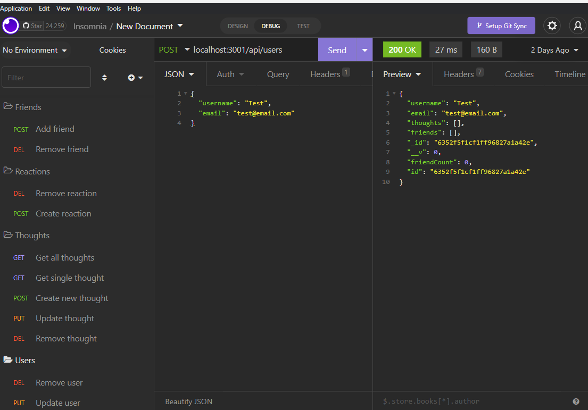
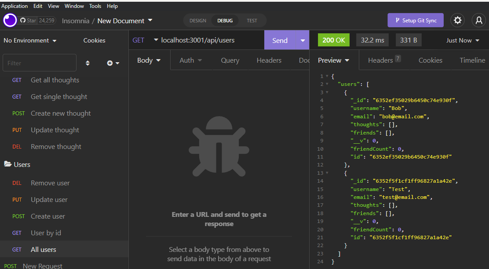

# social-network-api-nosql

A NoSQL Social Network API

## Description

A NoSQL Social Network API, using MongoDB, Mongoose and ExpressJS with NodeJS. The API allows you to create a user, update a user, remove a user, view individual user, or all users, users can also add friends or remove friends. The API also allows users to create thoughts, update thoughts, remove thoughts, get all thoughts, get individual thoughts, in addition to creating a reaction to a thought and removing a reaction as well.

## Screenshots

## Link to app demo

[App Demo Link](https://drive.google.com/file/d/1FUygZOmEjBR4LwiOcnjXSr48meHYkB29/view)
